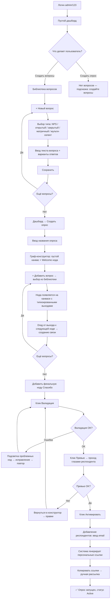
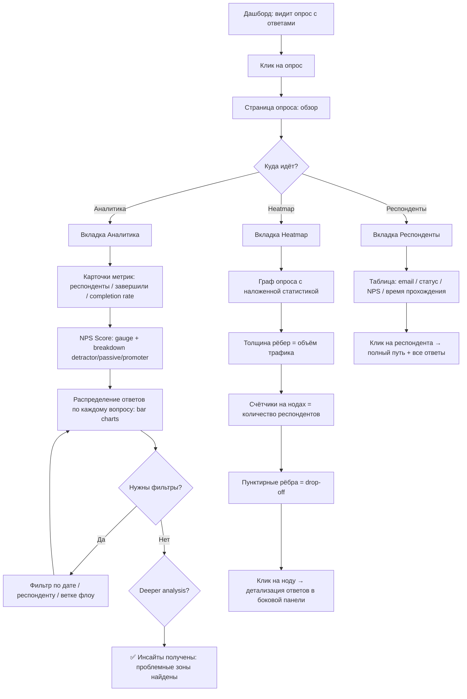
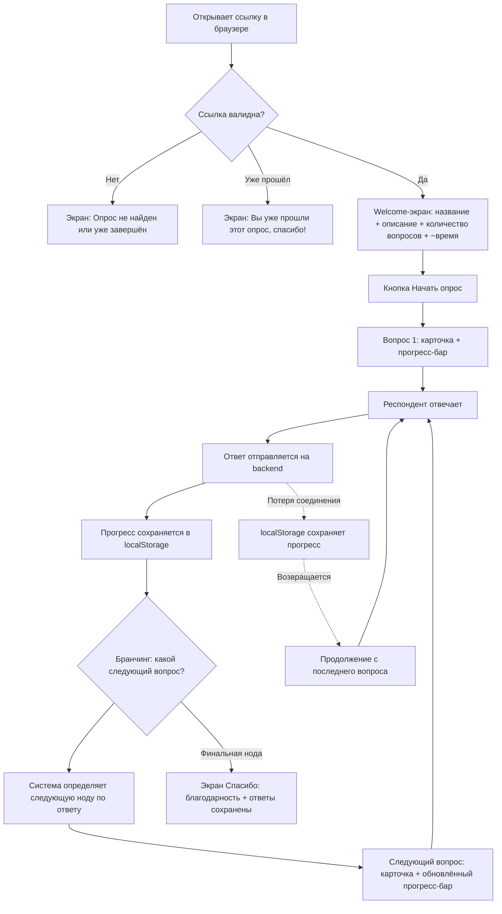
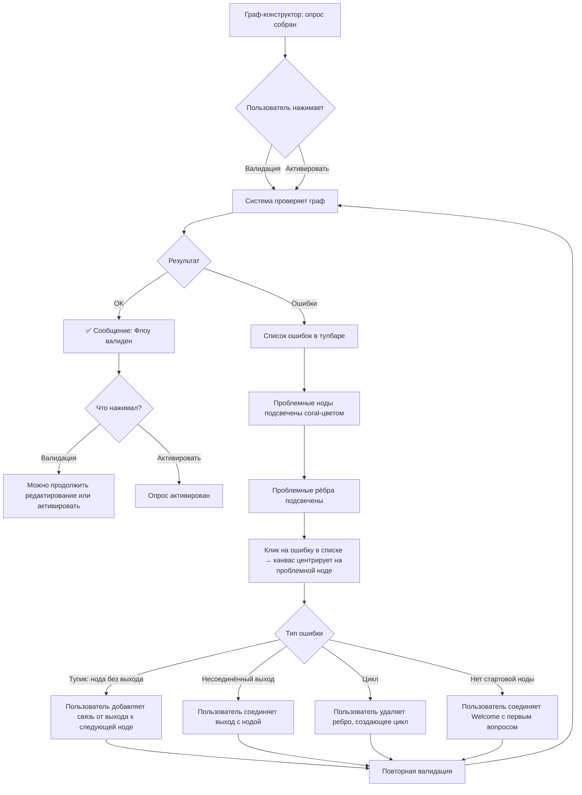

# UX Design Specification bmad-cem

**Author:** vkiryakov
**Date:** 2026-03-20

---

<!-- UX design content will be appended sequentially through collaborative workflow steps -->

## Executive Summary

### Project Vision

CEM-платформа для сбора обратной связи с визуальным граф-конструктором опросов на React Flow. Два ключевых отличия от существующих решений: (1) граф-конструктор, где каждый вопрос — нода с типизированными выходами, а граф определяет порядок и логику прохождения; (2) полный контроль данных на собственном сервере. MVP — single-user приложение для владельца SaaS-продукта, который хочет регулярно измерять удовлетворённость своих клиентов.

### Target Users

**Владимир (primary) — владелец SaaS-продукта**
- Единственный пользователь системы на этапе MVP
- Технически грамотный (intermediate), работает только с десктопа
- Создаёт вопросы в библиотеке, собирает из них опросы в граф-конструкторе, рассылает ссылки, анализирует результаты
- Типичный опрос: до 10 вопросов с бранчингом

**Респонденты (secondary) — конечные пользователи SaaS-продукта Владимира**
- Не являются пользователями системы — только проходят опросы по ссылке
- Не технически грамотные — интерфейс должен быть максимально простым
- Соотношение мобильных/десктопных: 50/50
- Получают персональную ссылку в мессенджере

### Key Design Challenges

1. **Два радикально разных UX-контекста** — сложная desktop-админка (граф-конструктор, аналитика, библиотека) vs минималистичный mobile-first интерфейс прохождения опроса. Фактически два отдельных продукта с разными паттернами взаимодействия.
2. **Интуитивность граф-конструктора** — React Flow с бранчингом, типизированными выходами и валидацией должен быть понятен без документации. Single-user означает, что нет коллег, которые объяснят.
3. **Нулевое трение для респондентов** — пользователи не tech-savvy, проходят опрос на мобильном. Любая заминка = drop-off. Опрос должен ощущаться как разговор, а не как форма.

### Design Opportunities

1. **Heatmap на графе как "aha-момент"** — совмещение конструктора и аналитики в одном визуальном пространстве. Уникальная фича, которой нет у конкурентов — видишь пути респондентов прямо на своём опросе.
2. **Компактные опросы (до 10 вопросов)** — прогресс-бар двигается заметно, прохождение ощущается быстрым. Возможность сделать каждый шаг визуально приятным.
3. **Прямолинейный UX без абстракций** — single-user MVP позволяет убрать организации, роли, настройки. Каждый экран решает одну задачу.

## Core User Experience

### Defining Experience

В продукте два фундаментально разных UX-контекста:

**Админка (Владимир, desktop):**
Центральное действие — сборка опроса в граф-конструкторе. Это определяющее взаимодействие продукта, которое отличает его от конкурентов. Вопросы добавляются из библиотеки по кнопке, бранчинг настраивается визуально через типизированные выходы нод. Анализ результатов — это причина существования продукта: NPS, распределение ответов, heatmap путей на графе.

**Прохождение опроса (респондент, mobile/desktop 50/50):**
Компактная карточка-виджет (не fullscreen Typeform-стиль). Один вопрос за раз, прогресс-бар с индикацией оставшихся вопросов. Минималистичный, чистый интерфейс без отвлекающих элементов. Цель — пройти быстро и без затруднений.

### Platform Strategy

- **Админка:** Desktop-only. Mouse/keyboard. React Flow граф-конструктор, таблицы, дашборды, аналитика.
- **Прохождение опроса:** Mobile + Desktop (50/50). Touch-friendly элементы на мобильных, адаптивный дизайн. Компактная карточка, не fullscreen.
- **Оффлайн:** Не требуется. Прогресс респондента сохраняется в localStorage как страховка от потери соединения.

### Effortless Interactions

1. **Добавление вопроса на граф** — кнопка "Добавить вопрос", выбор из библиотеки, нода появляется на графе. Минимум кликов.
2. **Автоматический бранчинг по типу** — NPS-вопрос автоматически создаёт три выхода (detractor/passive/promoter). Закрытый вопрос — выход на каждый вариант ответа. Пользователь не настраивает выходы вручную.
3. **Цикл публикации** — чёткий путь: редактирование графа → превью опроса (проверка от лица респондента) → активация → добавление респондентов → отправка ссылок.
4. **Прохождение опроса респондентом** — открыл ссылку → видишь вопрос → отвечаешь → следующий. Никаких регистраций, авторизаций, лишних экранов.

### Critical Success Moments

1. **"Lego-момент"** — первая сборка опроса в граф-конструкторе. Вопросы добавляются по кнопке, связи рисуются, NPS разветвляется автоматически. Ощущение: "это удобнее, чем формы с правилами".
2. **"Превью-уверенность"** — просмотр опроса глазами респондента перед активацией. Бранчинг работает, вопросы идут в нужном порядке. Ощущение: "я точно знаю, что увидят мои клиенты".
3. **"Heatmap-инсайт"** — первый heatmap на графе после сбора ответов. Статистика прохождений накладывается на граф, видны реальные пути респондентов. Ощущение: "я вижу, как люди проходят мой опрос".
4. **"Быстрое прохождение"** — респондент завершает опрос за пару минут. Компактная карточка, прогресс-бар двигается заметно, вопросы релевантны (бранчинг работает). Ощущение: "это было быстро и не напрягало".

### Experience Principles

1. **Граф — это продукт.** Всё крутится вокруг визуального графа: конструирование, валидация, аналитика (heatmap). Граф — единый язык для создания и анализа.
2. **Тип определяет поведение.** Тип вопроса автоматически задаёт выходы ноды и логику бранчинга. Пользователь выбирает тип — система делает остальное.
3. **Уверенность перед запуском.** Валидация + превью гарантируют, что респонденты не столкнутся с тупиками или ошибками.
4. **Нулевое трение для респондента.** Компактная карточка, один вопрос, понятный прогресс. Ничего лишнего — только вопрос и ответ.

## Desired Emotional Response

### Primary Emotional Goals

**Владимир (админка):**
- **Конструктор:** Эффективность и скорость. Ощущение: "я собираю опрос быстро, без лишних действий". Граф-конструктор как инструмент продуктивности, не как сложная система.
- **Аналитика:** Ясность и контроль. Ощущение: "я понимаю, что происходит". Данные дают чёткую картину: размер опроса, пути респондентов, проблемные точки — всё на виду.

**Респондент:**
- **Прохождение:** Лёгкость + значимость. Ощущение: "это было быстро и просто" + "моё мнение важно". Двойной эмоциональный слой: отсутствие трения + уважение к времени респондента.

### Emotional Journey Mapping

**Владимир:**
| Этап | Эмоция |
|---|---|
| Открывает конструктор | Готовность — "сейчас быстро соберу" |
| Добавляет вопросы на граф | Продуктивность — "всё встаёт на место" |
| Валидация находит ошибку | Информированность — "понятно, что исправить" |
| Превью опроса | Уверенность — "выглядит правильно" |
| Первые ответы приходят | Удовлетворение — "работает" |
| Heatmap на графе | Ясность — "вижу реальную картину" |

**Респондент:**
| Этап | Эмоция |
|---|---|
| Открывает ссылку | Нейтральность — "ок, посмотрим" |
| Первый вопрос | Простота — "ничего сложного" |
| Середина опроса | Прогресс — "уже почти" |
| Финальный экран | Завершённость — "готово, было несложно" |

### Micro-Emotions

**Критичные пары:**
- **Уверенность > Замешательство** — в конструкторе и аналитике Владимир всегда должен понимать, что происходит. Никаких неожиданных состояний.
- **Доверие > Скептицизм** — респондент должен доверять интерфейсу: прогресс-бар честный, данные не потеряются.
- **Удовлетворение > Фрустрация** — ошибки валидации сообщаются нейтрально и информативно, без блокирующих модалок или паники.

### Design Implications

- **Эффективность → минимум кликов.** Каждое действие в конструкторе — максимум 2 клика. Добавление вопроса, настройка бранчинга, валидация — всё быстро.
- **Ясность → данные на виду.** Аналитика: ключевые метрики видны сразу, без прокрутки. Heatmap читается интуитивно — толщина/цвет рёбер.
- **Нейтральная валидация → inline-сообщения.** Ошибки отображаются на графе (подсветка проблемной ноды) + текстовое описание. Без модальных окон, без "красных экранов".
- **Значимость респондента → тёплый тон.** Welcome-экран и финальный экран с благодарностью. Прогресс-бар показывает "осталось X вопросов" — уважение к времени.
- **Лёгкость → один вопрос = один экран.** Компактная карточка, крупные элементы, очевидное действие. Респондент никогда не гадает "что нажать".

### Emotional Design Principles

1. **Скорость = уважение.** Каждый лишний клик или секунда ожидания — это неуважение к времени пользователя. И для Владимира, и для респондента.
2. **Информирование, не запугивание.** Ошибки, валидация, пустые состояния — всегда нейтральный тон, конкретное объяснение, понятное следующее действие.
3. **Прозрачность данных.** Аналитика не скрывает и не приукрашивает. Владимир видит реальную картину — и это даёт ощущение контроля.
4. **Уважение к респонденту.** Опрос — это просьба о времени. Интерфейс должен это отражать: "спасибо, что уделили время", честный прогресс-бар, быстрое завершение.

## UX Pattern Analysis & Inspiration

### Inspiring Products Analysis

**n8n — визуальный конструктор автоматизаций**

Что делает хорошо:
- **Канвас с нодами** — чистое рабочее пространство, ноды добавляются быстро, связи рисуются интуитивно drag-and-drop от выхода к входу
- **Боковая панель настроек** — клик по ноде открывает панель справа без потери контекста графа
- **Типизированные выходы** — ноды имеют несколько выходов в зависимости от логики (success/error), что прямо соответствует нашим NPS-выходам (detractor/passive/promoter)
- **Мини-карта** — навигация по большим флоу
- **Цветовое кодирование** — разные типы нод визуально различимы
- **Execution overlay** — после запуска на графе видно, какие ноды сработали и какие данные прошли (аналог нашего heatmap)

Что можно улучшить для нашего контекста:
- n8n перегружен для нашей задачи — у нас проще: только вопросы и бранчинг, нет сложной конфигурации
- Наши ноды более однородны (5 типов вопросов vs сотни интеграций в n8n)

### Transferable UX Patterns

**Паттерны навигации:**
- **Канвас + боковая панель** (n8n) → конструктор опросов. Граф занимает основное пространство, настройки ноды — в боковой панели справа.
- **Тулбар сверху** → кнопки "Добавить вопрос", "Валидация", "Превью", статус опроса (Draft/Active/Completed).

**Паттерны взаимодействия:**
- **Drag от выхода к входу** (n8n) → соединение нод в нашем графе. Типизированные выходы (detractor/passive/promoter) как отдельные точки выхода на ноде.
- **Кнопка "+" для добавления** (n8n) → кнопка "Добавить вопрос" открывает выбор из библиотеки.
- **Execution overlay** (n8n) → heatmap на графе. Толщина/цвет рёбер показывает объём прохождений.

**Визуальные паттерны:**
- **Цветовое кодирование типов** → каждый тип вопроса (NPS, открытый, закрытый, матричный, мульти-селект) имеет свой цвет/иконку на ноде.
- **Чистый канвас с сеткой** → минималистичный фон, фокус на графе.
- **Карточки-дашборды** (общий паттерн) → аналитика: ключевые метрики (NPS score, completion rate, количество ответов) как карточки вверху, детализация ниже.

### Anti-Patterns to Avoid

1. **Перегруженные ноды** — n8n показывает много данных прямо на ноде. Наши ноды должны быть компактными: тип + название вопроса + цветовой маркер. Детали — в боковой панели.
2. **Скрытые списки правил** (Typeform, SurveyMonkey) — бранчинг через текстовые условия "если ответ X, то перейти к Y". Это именно то, что мы заменяем визуальным графом.
3. **Fullscreen модалки для настроек** — блокируют контекст графа. Только боковая панель.
4. **Нечестные прогресс-бары** — прогресс-бар респондента должен учитывать бранчинг. Если респондент идёт по короткой ветке, бар не должен показывать 30% после последнего вопроса.

### Design Inspiration Strategy

**Что перенимаем:**
- Канвас + боковая панель из n8n — проверенный паттерн для граф-инструментов
- Типизированные выходы нод из n8n — прямое соответствие нашей задаче
- Execution overlay → heatmap — визуализация данных прямо на графе

**Что адаптируем:**
- Упрощаем ноды n8n — у нас 5 типов вопросов, не сотни интеграций. Ноды компактнее и однороднее.
- Добавляем превью — n8n не имеет "глазами пользователя" режима, а нам он нужен для проверки опроса.

**Что создаём своё:**
- Компактная карточка респондента — нет прямого аналога, это наш собственный паттерн
- Аналитика: карточки метрик + heatmap на графе + распределение ответов. Принцип: красиво и понятно, данные на виду без перегрузки.

## Design System Foundation

### Design System Choice

**shadcn/ui + Tailwind CSS** — themeable система с полным контролем над кодом.

Технический стек уже определён в PRD: Next.js + shadcn/ui + Tailwind + React Flow. Дизайн-система строится на этом фундаменте.

### Rationale for Selection

- **Solo-developer** — shadcn/ui даёт production-ready компоненты без необходимости строить с нуля. Копируются в проект — полный контроль.
- **Accessibility из коробки** — Radix UI под капотом обеспечивает доступность без дополнительных усилий.
- **Гибкость кастомизации** — Tailwind позволяет задать визуальный стиль через токены (border-radius, цвета, spacing) один раз для всего проекта.
- **Совместимость с React Flow** — shadcn/ui не конфликтует с React Flow, оба работают в одном React-приложении.
- **Два UX-контекста** — одна система, два применения: полный набор компонентов для админки, минимальный subset для интерфейса респондента.

### Implementation Approach

**Компоненты shadcn/ui для админки:**
- Button, Input, Select, Textarea — формы создания/редактирования вопросов
- Table, Pagination — списки опросов, вопросов, респондентов
- Sheet (боковая панель) — настройки ноды в граф-конструкторе
- Card — карточки метрик на дашборде аналитики
- Badge — статусы опросов (Draft, Active, Completed, Archived)
- Tabs — переключение разделов аналитики
- Alert — inline-сообщения валидации

**Компоненты для интерфейса респондента:**
- Card — компактная карточка вопроса
- Button — кнопка "Далее"
- RadioGroup, Checkbox, Textarea, Slider — элементы ответа по типам вопросов
- Progress — прогресс-бар прохождения

**React Flow (отдельно):**
- Кастомные ноды (5 типов вопросов) стилизованные под shadcn/ui
- Кастомные рёбра для heatmap (толщина/цвет)
- Мини-карта, тулбар

### Customization Strategy

**Визуальный стиль: мягкий, rounded, приглушённый**

**Border-radius:**
- Увеличенные скругления: `rounded-xl` (12px) для карточек и панелей, `rounded-lg` (8px) для кнопок и инпутов
- Ноды графа — `rounded-xl` для мягкого, дружелюбного ощущения

**Цветовая палитра (приглушённая):**
- Основной фон: тёплый off-white / light gray
- Поверхности (карточки, панели): белый с мягкой тенью
- Акцентный цвет: приглушённый индиго или slate-blue — для кнопок, активных состояний
- Цвета типов вопросов (мягкие, пастельные): NPS — мягкий синий, открытый — мягкий зелёный, закрытый — мягкий фиолетовый, матричный — мягкий оранжевый, мульти-селект — мягкий розовый
- Heatmap: градиент от бледного к насыщенному (сохраняя приглушённость)
- Ошибки валидации: мягкий coral/salmon вместо агрессивного красного
- Текст: тёмно-серый (не чёрный) для комфортного чтения

**Типографика:**
- Inter или аналогичный нейтральный sans-serif
- Спокойные размеры, достаточный line-height для воздушности

**Общее ощущение:** спокойный, профессиональный инструмент без визуального шума. Мягкие формы + приглушённые цвета = ощущение надёжности и комфорта.

## Defining Experience

### Core Interaction

**"Собери опрос как граф, где каждый ответ определяет следующий вопрос"**

Определяющий опыт продукта — визуальная сборка опроса в граф-конструкторе. Каждая нода — отдельный вопрос. Каждый выходной узел ноды — конкретный вариант ответа. Соединяя выходы с другими нодами, пользователь создаёт динамический флоу: ответ респондента определяет, какой вопрос он увидит следующим. Второй слой опыта — аналитика: heatmap на том же графе показывает, как реальные люди проходили опрос.

### User Mental Model

**Ментальная модель: "блок-схема опроса"**

Пользователь думает о своём опросе как о блок-схеме с ветвлениями:
- Каждый блок — вопрос
- Стрелки из блока — варианты ответов
- Стрелка ведёт к следующему блоку-вопросу
- Разные ответы ведут к разным веткам

Эта модель знакома и интуитивна. Граф-конструктор делает её буквальной: то, что пользователь представляет в голове, он видит на экране.

**Текущие решения (и их проблемы):**
- Typeform/SurveyMonkey — бранчинг через скрытые правила ("если ответ = X, перейти к вопросу Y"). Пользователь не видит общую картину, не может визуально проверить все пути.
- Наш подход — граф IS опрос. Нет отдельного слоя правил. Связи на графе и есть логика прохождения.

### Success Criteria

**Когда пользователь говорит "это работает":**

1. **Сборка понятна** — добавил вопрос на граф, увидел выходные узлы, соединил со следующим вопросом. Без инструкций.
2. **Бранчинг визуален** — видно все ветки на одном экране. NPS-вопрос автоматически показывает 3 выхода (detractor/passive/promoter), закрытый вопрос — выход на каждый вариант.
3. **Граф читаем** — даже с 10 нодами и множественным бранчингом граф остаётся понятным. Цветовое кодирование типов + auto-layout помогают.
4. **Превью подтверждает** — можно пройти опрос "глазами респондента" и убедиться, что каждый ответ ведёт куда нужно.
5. **Аналитика на графе** — после сбора ответов тот же граф показывает реальные пути: где шли, где бросали, какие ветки популярны.

### Novel UX Patterns

**Комбинация знакомых паттернов в новом контексте:**

Граф-конструктор — знакомый паттерн (n8n, Miro, Figma). Опросы — знакомый паттерн (Typeform, Google Forms). Новизна в комбинации: граф-конструктор применён к опросам, где граф не просто визуализация — он IS логика прохождения.

**Знакомые паттерны (не нужно обучение):**
- Канвас с drag-and-drop (из n8n, Figma)
- Соединение нод рёбрами (из n8n)
- Боковая панель настроек (из n8n, IDE)
- Один вопрос за раз для респондента (из Typeform)

**Инновация (нужно минимальное обучение):**
- Выходные узлы ноды = варианты ответов — пользователь должен понять, что выход ноды соответствует конкретному ответу
- Heatmap на графе — наложение аналитики на конструктор, двойное использование одного визуального пространства

**Обучение через онбординг:**
- Пустой дашборд → кнопка "Создать опрос" → первый граф с подсказками (tooltip на первой ноде: "это ваш вопрос, выходы — варианты ответов")

### Experience Mechanics

**1. Initiation — начало сборки:**
- Дашборд → кнопка "Создать опрос" → ввод названия → открывается граф-конструктор
- Пустой канвас с одной стартовой нодой "Welcome" (уже на графе)
- Тулбар сверху: "Добавить вопрос", "Валидация", "Превью"

**2. Interaction — сборка графа:**
- Кнопка "Добавить вопрос" → выбор из библиотеки → нода появляется на канвасе
- Нода отображает: тип (цвет/иконка) + текст вопроса (сокращённый) + выходные узлы
- Выходные узлы генерируются автоматически по типу: NPS → 3 выхода, закрытый → по количеству вариантов, открытый → 1 выход (default)
- Drag от выходного узла к другой ноде → создание связи
- Клик по ноде → боковая панель справа с полными настройками вопроса

**3. Feedback — обратная связь:**
- Успешное соединение: ребро отрисовывается, цвет подтверждает связь
- Валидация: кнопка "Валидация" подсвечивает проблемные ноды (тупики, несоединённые выходы) мягким coral-цветом + текстовое описание ошибки
- Превью: переход в режим "глазами респондента" — прохождение опроса по графу

**4. Completion — завершение:**
- Валидация пройдена → кнопка "Активировать" становится доступной
- Добавление респондентов (email) → генерация персональных ссылок
- Опрос запущен → статус "Active" на дашборде
- Далее: мониторинг прохождений, аналитика, heatmap

## Visual Design Foundation

### Color System

**Палитра: приглушённая, спокойная, профессиональная**

**Основные цвета:**
- Background: `slate-50` (#f8fafc) — тёплый off-white для основного фона
- Surface: `white` (#ffffff) — карточки, панели, ноды с мягкой тенью `shadow-sm`
- Primary (акцент): `slate-600` (#475569) — кнопки, активные состояния, ссылки
- Primary hover: `slate-700` (#334155)
- Border: `slate-200` (#e2e8f0) — разделители, границы карточек

**Семантические цвета:**
- Success: `emerald-500` (#10b981) — успешная валидация, статус "Completed"
- Warning: `amber-500` (#f59e0b) — статус "In Progress"
- Error: `rose-400` (#fb7185) — мягкий coral для ошибок валидации
- Info: `sky-500` (#0ea5e9) — подсказки, информационные сообщения

**Цвета типов вопросов (пастельные, для нод графа):**

| Тип вопроса | Фон ноды | Акцент | Tailwind |
|---|---|---|---|
| NPS | `blue-50` | `blue-400` | bg-blue-50 border-blue-400 |
| Открытый | `emerald-50` | `emerald-400` | bg-emerald-50 border-emerald-400 |
| Закрытый | `violet-50` | `violet-400` | bg-violet-50 border-violet-400 |
| Матричный | `amber-50` | `amber-400` | bg-amber-50 border-amber-400 |
| Мульти-селект | `pink-50` | `pink-400` | bg-pink-50 border-pink-400 |

**Цвета статусов опроса (Badge):**

| Статус | Цвет | Tailwind |
|---|---|---|
| Draft | `slate-100` + `slate-600` text | bg-slate-100 text-slate-600 |
| Active | `emerald-100` + `emerald-700` text | bg-emerald-100 text-emerald-700 |
| Completed | `sky-100` + `sky-700` text | bg-sky-100 text-sky-700 |
| Archived | `slate-100` + `slate-400` text | bg-slate-100 text-slate-400 |

**Heatmap (градиент на рёбрах графа):**
- Минимальный трафик: `slate-200` (тонкое, бледное ребро)
- Средний трафик: `blue-300` → `blue-400`
- Высокий трафик: `blue-500` → `blue-600` (толстое, насыщенное ребро)
- Drop-off: `rose-300` (пунктирное ребро)

### Typography System

**Шрифт: Inter**

Нейтральный, хорошо читаемый sans-serif. Отличная поддержка кириллицы. Оптимизирован для экранов.

**Шкала типографики:**

| Элемент | Размер | Weight | Line-height | Использование |
|---|---|---|---|---|
| h1 | 24px (text-2xl) | 600 (semibold) | 1.3 | Заголовки страниц |
| h2 | 20px (text-xl) | 600 (semibold) | 1.35 | Заголовки секций |
| h3 | 16px (text-base) | 600 (semibold) | 1.4 | Заголовки карточек |
| body | 14px (text-sm) | 400 (normal) | 1.5 | Основной текст, таблицы |
| small | 12px (text-xs) | 400 (normal) | 1.5 | Подписи, метки, timestamps |
| node-title | 13px | 500 (medium) | 1.3 | Текст на нодах графа |
| node-label | 11px | 400 (normal) | 1.2 | Метки выходов нод |

**Цвета текста:**
- Primary text: `slate-800` (#1e293b) — заголовки, основной контент
- Secondary text: `slate-500` (#64748b) — подписи, вспомогательный текст
- Muted text: `slate-400` (#94a3b8) — плейсхолдеры, неактивные элементы

### Spacing & Layout Foundation

**Подход: компактный, информативный (как n8n)**

**Базовый юнит: 4px**

| Токен | Значение | Использование |
|---|---|---|
| xs | 4px | Внутренние отступы мелких элементов (badge, tag) |
| sm | 8px | Отступы между связанными элементами |
| md | 12px | Padding кнопок, инпутов |
| lg | 16px | Padding карточек, секций |
| xl | 24px | Отступы между секциями |
| 2xl | 32px | Отступы между крупными блоками |

**Layout — админка (desktop):**
- Sidebar навигации: фиксированная, 240px, слева
- Основной контент: flex-1, padding 24px
- Граф-конструктор: канвас на всю ширину контентной области, тулбар сверху (48px высота), боковая панель настроек справа (360px, по клику на ноду)
- Таблицы: компактные строки (40px высота), плотная подача данных

**Layout — интерфейс респондента:**
- Центрированная карточка, max-width 480px
- Padding 24px внутри карточки
- Прогресс-бар сверху, кнопка "Далее" внизу
- На мобильном: карточка растягивается на ширину экрана с padding 16px

**Grid:**
- Аналитика: CSS Grid, 2-3 колонки для карточек метрик
- Списки: однокалоночный layout с таблицами
- Граф: без grid, свободный канвас React Flow

### Accessibility Considerations

- **Контрастность:** все комбинации text/background соответствуют WCAG 2.1 AA (минимум 4.5:1 для текста, 3:1 для крупного текста)
- **Цвета ошибок:** rose-400 на белом фоне — дополнительно используется иконка и текст, не только цвет
- **Типы вопросов:** цветовое кодирование дублируется иконками — не только цвет различает типы
- **Фокус:** visible focus ring (`ring-2 ring-slate-400 ring-offset-2`) на всех интерактивных элементах
- **Размер touch-target:** минимум 44x44px для кнопок и элементов ответа в интерфейсе респондента (мобильный)
- **Шрифт:** Inter — высокая x-height, хорошая читаемость при 14px

## Design Direction Decision

### Design Directions Explored

Сгенерировано 8 дизайн-направлений в HTML-файле (`ux-design-directions.html`), покрывающих все ключевые экраны продукта:

1. **Dashboard** — обзор опросов с метриками (4 карточки) и карточками опросов (grid 2 колонки)
2. **Граф-конструктор** — канвас React Flow + тулбар сверху + боковая панель настроек 360px справа
3. **Библиотека вопросов** — таблица с фильтрами по типу (pill-кнопки), поиск, пагинация
4. **Аналитика** — карточки метрик (3 колонки) + NPS gauge + bar charts + таблица респондентов
5. **Респондент Mobile** — компактная карточка 375px, NPS с кнопками 0-10, прогресс-бар
6. **Респондент Desktop** — центрированная карточка 520px, закрытый вопрос с radio-вариантами
7. **Heatmap на графе** — толщина/цвет рёбер = трафик, счётчики на нодах, drop-off пунктиром, легенда
8. **Welcome/Thanks** — приглашающий тон, информация о длительности, мягкий зелёный финальный экран

### Chosen Direction

**Принято: все 8 направлений как единый визуальный язык.**

Все направления выполнены в согласованном стиле и формируют целостную систему. Пользователь утвердил визуальное решение без изменений.

### Design Rationale

- **Единый визуальный язык** — slate палитра, Inter, rounded-xl, компактный layout — применяется одинаково ко всем экранам
- **Два UX-контекста решены** — админка (sidebar + контент, desktop-only, компактно) и респондент (центрированная карточка, mobile-friendly, минималистично)
- **n8n-паттерны адаптированы** — канвас + боковая панель + типизированные выходы, но упрощены для 5 типов вопросов
- **Heatmap читаем** — толщина рёбер + цветовой градиент + счётчики + пунктирный drop-off дают ясную картину без перегрузки

### Implementation Approach

- shadcn/ui компоненты как база для всех экранов
- React Flow с кастомными нодами (5 типов) и кастомными рёбрами (heatmap)
- Tailwind CSS токены из Visual Design Foundation для единообразия
- HTML-файл `ux-design-directions.html` — референс для разработки каждого экрана

## User Journey Flows

### Journey 1: Первый запуск и создание опроса

**Цель:** От пустого приложения до запущенного опроса с разосланными ссылками.

**Entry point:** Логин (admin/123) → пустой дашборд

**Ключевые решения:**
- Пустой дашборд направляет к созданию вопросов (не опроса) — сначала библиотека
- Валидация → Превью → Активация — три последовательных шага уверенности
- Респонденты добавляются после активации

### Journey 2: Анализ результатов

**Цель:** Понять, довольны ли клиенты, найти проблемные зоны.

**Entry point:** Дашборд → опрос со статусом Active/Completed

**Ключевые решения:**
- Три вкладки аналитики: метрики/графики, heatmap на графе, таблица респондентов
- Heatmap — отдельная вкладка, не overlay на конструкторе (разделение режимов: создание vs анализ)
- Клик на ноду в heatmap → детализация в боковой панели

### Journey 3: Респондент проходит опрос

**Цель:** Быстро и без трения пройти опрос от начала до конца.

**Entry point:** Персональная ссылка из мессенджера

**Ключевые решения:**
- Welcome-экран показывает количество вопросов и примерное время — уважение к респонденту
- Каждый ответ отправляется сразу (не в конце) — данные не теряются
- localStorage как страховка от потери соединения
- Прогресс-бар учитывает бранчинг: показывает "Вопрос X из Y" где Y — длина текущего пути
- Обработка edge cases: невалидная ссылка, повторное прохождение

### Journey 4: Ошибка валидации флоу

**Цель:** Обнаружить и исправить ошибку в графе до запуска опроса.

**Entry point:** Граф-конструктор → кнопка "Валидация" или "Активировать"

**Ключевые решения:**
- Валидация запускается и при нажатии "Валидация", и при "Активировать" (невозможно запустить невалидный опрос)
- Ошибки отображаются inline: список в тулбаре + подсветка на графе (не модалки)
- Клик на ошибку центрирует канвас на проблемной ноде — быстрая навигация
- Четыре типа ошибок: тупик, несоединённый выход, цикл, отсутствие стартовой связи

### Journey Patterns

**Навигационные паттерны:**
- **Sidebar → Content** — основная навигация через sidebar (Дашборд, Опросы, Вопросы, Аналитика)
- **Tabs внутри страницы** — вкладки для переключения контекста без потери страницы (аналитика: метрики / heatmap / респонденты)
- **Drill-down** — клик на элемент списка → детальная страница (опрос → конструктор/аналитика)

**Паттерны решений:**
- **Последовательная уверенность** — Валидация → Превью → Активация. Три шага перед запуском.
- **Автоматическое определение** — тип вопроса определяет выходы ноды, ответ респондента определяет следующий вопрос. Минимум ручной конфигурации.

**Паттерны обратной связи:**
- **Inline-ошибки** — подсветка на графе + текст в тулбаре, без модалок
- **Прогресс-бар** — для респондента (вопрос X из Y) и для статуса опроса (badge Draft/Active/Completed)
- **Мгновенная отправка** — каждый ответ респондента отправляется сразу, не в конце

### Flow Optimization Principles

1. **Минимум шагов до ценности** — от логина до запущенного опроса: создать вопросы → собрать граф → валидация → превью → активация → добавить респондентов. Каждый шаг обязателен, лишних нет.
2. **Fail fast, recover fast** — валидация ловит ошибки до запуска. Клик на ошибку ведёт прямо к проблемному месту. Исправление → повторная валидация за секунду.
3. **Данные не теряются** — ответы респондента отправляются по одному. localStorage как backup. Повторный визит продолжает с последнего вопроса.
4. **Разделение режимов** — конструктор (создание) и heatmap (аналитика) — разные вкладки/режимы одного графа. Не смешиваем создание с анализом.

## Component Strategy

### Design System Components

**shadcn/ui — покрытие по экранам:**

| Экран | Компоненты shadcn/ui |
|---|---|
| Dashboard | Card, Badge, Button |
| Библиотека вопросов | Table, Input, Button, Badge, Pagination, Dialog |
| Конструктор (UI вокруг графа) | Button, Sheet, Input, Select, Textarea, Alert |
| Аналитика | Card, Tabs, Table, Badge, Pagination |
| Респондент | Card, Button, RadioGroup, Checkbox, Textarea, Slider, Progress |
| Общие | Sidebar (custom на базе shadcn), Tooltip, DropdownMenu |

**Итого из shadcn/ui:** Button, Card, Badge, Table, Input, Select, Textarea, Dialog, Sheet, Tabs, Pagination, RadioGroup, Checkbox, Slider, Progress, Tooltip, DropdownMenu, Alert

### Custom Components

**1. SurveyNode — нода вопроса на графе**

- **Purpose:** Отображение вопроса как ноды в React Flow граф-конструкторе
- **Content:** Иконка типа + цветовой маркер + сокращённый текст вопроса + выходные узлы
- **States:** default, selected (синяя обводка), error (coral подсветка), heatmap (с счётчиком)
- **Variants:** 5 типов по цвету — NPS (blue), открытый (emerald), закрытый (violet), матричный (amber), мульти-селект (pink)
- **Anatomy:**
  - Header: [цветная точка типа] [текст вопроса, truncate 30 символов]
  - Body: список выходных узлов (точки с подписями)
  - Выходные узлы: генерируются автоматически по типу вопроса
- **Size:** ~160-200px ширина, высота зависит от количества выходов
- **Accessibility:** aria-label с полным текстом вопроса, keyboard-navigable

**2. WelcomeNode — стартовая нода**

- **Purpose:** Точка входа в опрос на графе
- **Content:** Иконка + "Welcome"
- **States:** default, selected
- **Anatomy:** Компактная нода slate-цвета с одним выходом "Начать"

**3. ThankYouNode — финальная нода**

- **Purpose:** Завершение опроса на графе
- **Content:** Иконка + "Спасибо"
- **States:** default, selected
- **Anatomy:** Компактная нода slate-цвета без выходов

**4. HeatmapEdge — кастомное ребро графа**

- **Purpose:** Визуализация трафика между нодами в режиме heatmap
- **Content:** Линия переменной толщины + опциональная подпись с числом
- **States:** normal (blue градиент по толщине), drop-off (пунктирная rose линия)
- **Variants:** thin (1-2px, мало трафика), medium (3-4px), thick (5-6px, много трафика)

**5. SurveyCard — карточка опроса на дашборде**

- **Purpose:** Превью опроса в списке на дашборде
- **Content:** Название + дата + количество вопросов + Badge статуса + мини-статистика (респонденты, завершили, NPS)
- **States:** default, hover (shadow увеличивается)
- **Anatomy:** Card с header (название + badge) + meta (дата, кол-во вопросов) + footer (статистика)

**6. RespondentCard — карточка вопроса для респондента**

- **Purpose:** Отображение одного вопроса при прохождении опроса
- **Content:** Текст вопроса + элемент ответа (зависит от типа) + кнопка "Далее"
- **Variants по типу вопроса:**
  - NPS: сетка кнопок 0-10 + подписи "Совсем нет" / "Обязательно"
  - Открытый: Textarea
  - Закрытый: RadioGroup с вариантами
  - Матричный: таблица с RadioGroup в каждой строке
  - Мульти-селект: Checkbox группа
- **States:** empty (кнопка "Далее" disabled), answered (кнопка активна), submitting (loading)
- **Responsive:** max-width 480px, на мобильном — full-width с padding 16px

**7. NpsGauge — виджет NPS Score**

- **Purpose:** Отображение NPS score + breakdown на аналитике
- **Content:** Число NPS (-100 до +100) + bar с тремя сегментами (detractor/passive/promoter) + проценты
- **Anatomy:** Крупное число слева + stacked bar справа + подписи

**8. ValidationAlert — inline-алерт валидации**

- **Purpose:** Отображение результатов валидации флоу в тулбаре конструктора
- **Content:** Список ошибок с типом и описанием
- **States:** success (зелёный, "Флоу валиден"), error (coral, список ошибок)
- **Interaction:** Клик на ошибку → канвас центрирует на проблемной ноде

### Component Implementation Strategy

**Принцип: shadcn/ui для стандартного UI, кастом только для domain-specific**

- Стандартные формы, таблицы, навигация → shadcn/ui as-is с кастомизацией через Tailwind токены
- Граф-компоненты (SurveyNode, WelcomeNode, ThankYouNode, HeatmapEdge) → кастомные React-компоненты для React Flow, стилизованные под shadcn/ui
- Domain-компоненты (SurveyCard, RespondentCard, NpsGauge, ValidationAlert) → композиция из shadcn/ui примитивов + кастомная логика

### Implementation Roadmap

**Phase 1 — Core (критичный путь J1: создание опроса):**
- SurveyNode (5 вариантов) + WelcomeNode + ThankYouNode
- ValidationAlert
- RespondentCard (5 вариантов по типу вопроса)

**Phase 2 — Dashboard & Distribution (J1 завершение):**
- SurveyCard
- Все shadcn/ui компоненты для библиотеки вопросов и списков

**Phase 3 — Analytics (J2: анализ результатов):**
- HeatmapEdge
- NpsGauge
- Bar charts (можно использовать Recharts или аналог)

## UX Consistency Patterns

### Button Hierarchy

**Три уровня кнопок:**

| Уровень | Стиль | Использование | Примеры |
|---|---|---|---|
| Primary | `btn-primary` (slate-600, white text) | Одно главное действие на экране | "Создать опрос", "Активировать", "Далее" |
| Outline | `btn-outline` (border, slate text) | Вторичные действия | "Валидация", "Превью", "Фильтры" |
| Ghost/SM | `btn-sm` (compact) | Действия в тулбаре и таблицах | "✏️", "+ Добавить вопрос" |

**Правила:**
- Максимум одна Primary-кнопка на экран (исключение: тулбар конструктора — Primary = "Активировать")
- Деструктивные действия: красный текст на outline-кнопке + confirm dialog
- Disabled state: `opacity-50 cursor-default` — без tooltip объяснения (single-user, контекст очевиден)

### Feedback Patterns

**Успех:**
- Inline: зелёная полоска вверху страницы, автоисчезает через 3 секунды
- Примеры: "Вопрос создан", "Опрос активирован", "Респондент добавлен"

**Ошибки:**
- Валидация графа: coral-подсветка нод + список в тулбаре (кликабельный)
- Формы: красный текст под полем, border `rose-400`
- API-ошибки: inline alert вверху страницы, не исчезает (нужно закрыть)
- Тон: нейтральный, информативный. "Нода «NPS» не имеет исходящих связей" — не "Ошибка!"

**Предупреждения:**
- Перед деструктивными действиями: Dialog с описанием последствий
- Примеры: архивация опроса, удаление вопроса

**Пустые состояния:**
- Иллюстрация/иконка + заголовок + описание + CTA-кнопка
- Дашборд: "У вас ещё нет опросов" → кнопка "Создать опрос"
- Библиотека: "Начните с создания вопросов" → кнопка "Новый вопрос"
- Аналитика: "Ожидание ответов" (если опрос Active, но ответов нет)

**Loading:**
- Скелетоны (skeleton) для таблиц и карточек — не спиннеры
- Граф-конструктор: показывать канвас сразу, ноды подгружаются
- Кнопки при отправке: disabled + "Сохранение..." (текст меняется)

### Form Patterns

**Создание/редактирование вопросов:**
- Все поля в одном view (не wizard), потому что вопрос — простая сущность
- Валидация: при потере фокуса (onBlur) + при submit
- Обязательные поля: нет маркера "*" — все поля обязательны кроме подсказки
- Сохранение: явная кнопка "Сохранить", без автосохранения

**Ввод респондентов:**
- Одно поле email + кнопка "Добавить"
- Валидация формата email при submit
- Дедупликация: "Этот email уже добавлен" — inline под полем
- Batch: возможность ввести несколько email через запятую

**Боковая панель конструктора (Sheet):**
- Открывается по клику на ноду
- Закрывается: по клику вне панели, по Esc, по кнопке "×"
- Изменения применяются сразу (live update ноды на графе)
- Нет кнопки "Сохранить" в панели — граф сохраняется целиком

### Navigation Patterns

**Sidebar (постоянная):**
- 4 пункта: Дашборд, Опросы, Вопросы, Аналитика
- Активный пункт: `bg-slate-100 text-slate-800 font-medium`
- Collapsed state: не нужен (desktop-only, 240px допустимо)

**Breadcrumb внутри страниц:**
- Опросы → Удовлетворённость Q1 → Конструктор
- Опросы → Удовлетворённость Q1 → Аналитика
- Не более 3 уровней

**Tabs (внутри страницы):**
- Аналитика опроса: Метрики | Heatmap | Респонденты
- Страница опроса: Конструктор | Респонденты | Настройки

**Переходы:**
- Клик на карточку опроса → страница опроса (конструктор или аналитика в зависимости от статуса)
- Draft → открывается конструктор
- Active/Completed → открывается аналитика

### Modal & Overlay Patterns

**Когда использовать Dialog:**
- Подтверждение деструктивных действий (архивация, удаление)
- Создание нового опроса (ввод названия)
- НЕ для отображения информации — только для действий, требующих подтверждения

**Когда использовать Sheet (боковая панель):**
- Настройки ноды в граф-конструкторе
- Детализация респондента в heatmap

**Правила:**
- Максимум один overlay одновременно (нет вложенных модалок)
- Закрытие: Esc, клик вне, кнопка "×"
- Focus trap внутри открытого overlay

### Search & Filter Patterns

**Поиск:**
- Одно поле поиска в topbar страницы
- Опросы: поиск по названию
- Вопросы: поиск по тексту вопроса
- Респонденты: поиск по email
- Debounce 300ms, поиск при вводе (без кнопки)

**Фильтры:**
- Библиотека вопросов: pill-кнопки по типу (Все / NPS / Открытый / ...) — одна активна
- Аналитика: фильтры по дате, респонденту, ветке — dropdown-кнопка "Фильтры" → выпадающая панель
- Активные фильтры показываются как badges рядом с кнопкой "Фильтры"

### Pagination Pattern

- Все списки: 10 элементов на страницу
- Внизу: "Показано X из Y" слева + кнопки навигации справа
- Компактные кнопки: ← 1 2 3 →
- Активная страница: `bg-slate-600 text-white`

## Responsive Design & Accessibility

### Responsive Strategy

**Два контекста — две стратегии:**

**Админка (desktop-only):**
- Минимальная ширина: 1024px. Нет адаптации под мобильные/планшеты.
- Sidebar 240px + контент flex-1. Конструктор: канвас + панель 360px.
- При ширине < 1024px: горизонтальный скролл (допустимо для desktop-only инструмента).

**Интерфейс респондента (mobile + desktop 50/50):**
- Mobile-first подход. Карточка адаптируется от full-width до max-width 480px.
- Touch-friendly элементы: минимум 44x44px для кнопок и элементов ответа.
- Один layout — карточка по центру. На мобильном растягивается на ширину.

### Breakpoint Strategy

| Breakpoint | Ширина | Применение |
|---|---|---|
| mobile | < 640px (sm) | Респондент: карточка full-width, padding 16px |
| tablet | 640px - 1023px | Респондент: карточка max-width 480px, центрирована |
| desktop | ≥ 1024px (lg) | Админка: sidebar + контент. Респондент: карточка max-width 480px |

**Только интерфейс респондента адаптируется.** Админка — фиксированный desktop layout.

**Адаптация карточки респондента по breakpoints:**

| Элемент | Mobile (< 640px) | Desktop (≥ 640px) |
|---|---|---|
| Карточка | full-width, padding 16px, без border-radius | max-width 480px, padding 24px, rounded-xl, shadow |
| Кнопки NPS (0-10) | 40x40px, gap 4px | 48x48px, gap 4px |
| Кнопка "Далее" | full-width, fixed bottom | full-width внутри карточки |
| Текст вопроса | 16px | 20px |
| Прогресс-бар | full-width сверху | внутри карточки |

### Accessibility Strategy

**Уровень: WCAG 2.1 AA базовый**

Фокус на контрастности, keyboard navigation и touch targets. Screen reader оптимизация — вне скоупа MVP.

**Контрастность:**
- Текст на фоне: минимум 4.5:1 для body text (14px), 3:1 для large text (≥ 18px)
- Все комбинации из Color System проверены:
  - `slate-800` на `white` → 12.6:1 ✅
  - `slate-500` на `white` → 5.0:1 ✅
  - `slate-400` на `white` → 3.5:1 — только для large text и декоративных элементов
  - `rose-400` на `white` → 3.2:1 — дополняется иконкой и текстом ошибки
- Цветовое кодирование типов вопросов дублируется иконками

**Keyboard Navigation (админка):**
- Tab для перехода между интерактивными элементами
- Enter/Space для активации кнопок и чекбоксов
- Esc для закрытия Sheet и Dialog
- Visible focus ring: `ring-2 ring-slate-400 ring-offset-2`
- Граф-конструктор: базовая keyboard навигация React Flow (стрелки для перемещения, Tab между нодами)

**Touch Targets (респондент):**
- Минимум 44x44px для всех интерактивных элементов
- NPS кнопки: 40-48px (достаточно для touch)
- Radio/Checkbox варианты: вся строка кликабельна, не только кружок
- Кнопка "Далее": full-width, height 48px

### Testing Strategy

**Responsive testing:**
- Chrome DevTools device emulation: iPhone SE, iPhone 14, iPad, Desktop 1280px
- Реальное устройство: один Android-телефон + один iPhone для финальной проверки
- Тестировать только интерфейс респондента на мобильных

**Accessibility testing:**
- Lighthouse accessibility audit в Chrome DevTools (целевой score: ≥ 90)
- Ручная проверка Tab-навигации по всем основным флоу админки
- Проверка контрастности: Chrome DevTools → Rendering → Emulate vision deficiencies

**Не в скоупе MVP:**
- Screen reader тестирование (VoiceOver, NVDA)
- Тестирование с пользователями с ограниченными возможностями
- WCAG AAA compliance

### Implementation Guidelines

**Responsive:**
- Tailwind responsive prefixes: `sm:`, `lg:` для адаптации карточки респондента
- Единицы: `rem` для типографики, `px` для border/shadow, `%` и `max-width` для layout
- Изображения: нет (продукт text/data-based), оптимизация не требуется

**Accessibility:**
- Semantic HTML: `<nav>`, `<main>`, `<section>`, `<button>`, `<table>`
- `aria-label` на иконочных кнопках (без текста)
- `role="status"` на toast-уведомлениях успеха
- `aria-current="page"` на активном пункте sidebar
- `<label>` связан с каждым `<input>` через `htmlFor`
- Не использовать `div` и `span` как интерактивные элементы — только `button`, `a`, `input`
